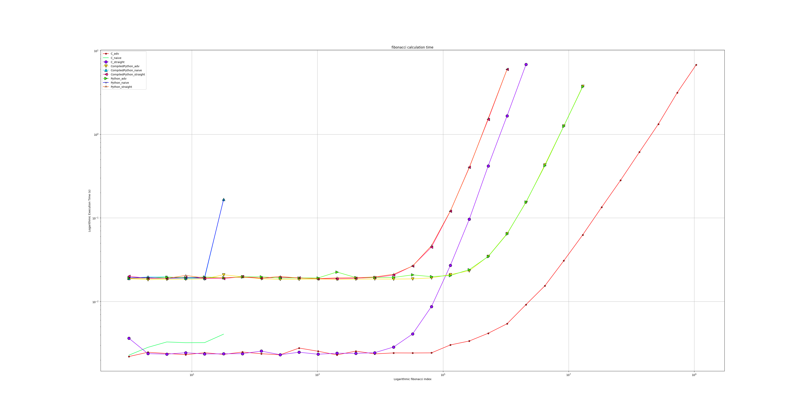

# Programming Languages Performance Comparison

## What is this?
This section of the project is comparing runtime between different languages.

The used code is written from-scratch, for "authentic" results. Also no writing code that's uncharacteristic to the language - only typical usage, without rule-bending:
* Python is written concisely
* C is written responsibly and with the important optimizations in mind
* Rust is written as if trying to prove a point
* Bash is written like it's just for fun
* \<the language you hate\> is written like the piece of shit that it is

## What kind of info can I get from it?
The barely useful kind.

But take a look at the analysis bullet-points. You'd either go "that's interesting" or "well, obviously" (or: "this idiot can't read graphs") 

If you're actually that concerned about computation speed, this program's graphs can give you a rough idea of what language is better overall.

If you wanted to see how your favorite language fares against others, it's not a good metric. But feel free to do so anyway, it's not like I'm in a position to stop you.

Runtime depends a lot on the algorithm you implement, and your implementation.
Some problems are ill-suited for some languages (they're not the right tool for the job).
Some problems are even language-dependent; you'd probably get similar results working on AI in any language, because the bulk of the work is done by the same compiled C binaries. So, sadly these comparisons barely tell you anything.

## How can this program fix my life?

How about nice-looking graphs?

Take it or leave it, it's all I have to offer.

###### "Fibonacci calculation time" - log-graph of how long it takes to calculate at how far an index
Notice the scale. This simple task requires little sophistication. No classes or complicated data management, just raw single-threaded performance.
* C is almost 100 times faster than Python
* Compiled Python runs the same as Python (because it gets compiled anyway)
* Exponential-time algorithms won't get you far, no matter the language
* Running a binary file is slightly but constantly faster than running in some language's container shell
* You won't see a difference between the smart (logarithmic) solution and the simple (linear) straight-forward one until you're in the magnitude of n=10k 

This is a work in progress, more will be added. Hopefully.
